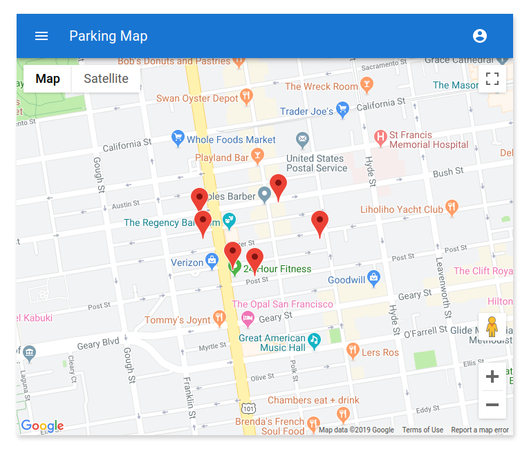
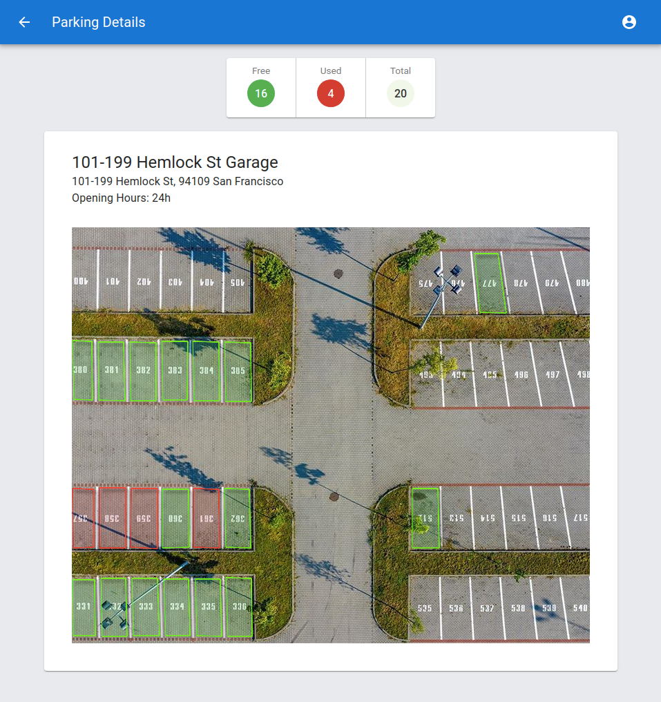
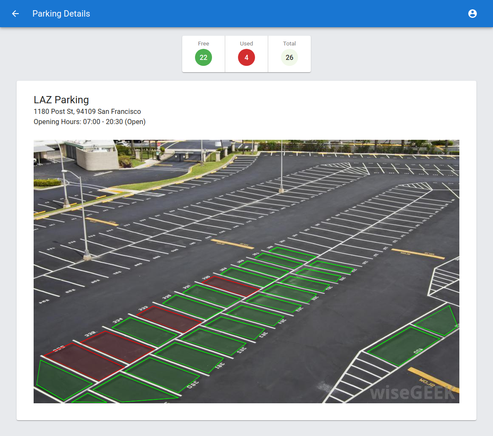

# Smart Parking
Cloud and Web dashboard for real-time visualization of parking slots.

[Dashboard Demo](https://d1h3e1ucojuxt4.cloudfront.net/)







## Serverless Architecture


Cloud
- AWS Amplify
- AWS AppSync (using multiple authorization types)
- AWS Cognito
- DynamoDB
- Lambda
- S3

CI/CD
- GitHub Actions (CI)
- AWS Amplify Console (CD)

Web app
- React
- TypeScript
- GraphQL
- Amplify

Mobile app
- React Native

## Features

- Authorization (Amplify React component, AWS Cognito)
- Show parking slots (GraphQL, AWS AppSync)
- Update slot status in real-time (GraphQL subscriptions, AWS AppSync)


## Getting Started


```sh
# Install Amplify CLI globally
npm install -g @aws-amplify/cli
amplify configure

# Install project and dependencies
git clone https://github.com/sonufrienko/smart-parking
cd smart-parking
npm i

# Create a AWS CloudFormation stack
amplify init

# Update the cloud resources (deployment)
amplify push

# Build and publish both the backend and the front end
# Upload React app to the S3 hosting bucket
amplify publish
```

Generate aws-exports.js
```sh
amplify init
# ? Do you want to use an existing environment? **Yes**
# ? Choose the environment you would like to use: **dev**
```

Branches
- `master` - Production branch (protected). Used by Amplify Console for Continuous Deployment.
- `dev` - Development branch.


Mocking and Testing
```sh
export AWS_REGION=us-west-2

# Execute local Lambda function
amplify mock function listSlots

# Start GraphQL server
amplify mock api
```

## Request from LoRa Gateway

Request to change parking slot status:

- `APPSYNC-API-URL` - AppSync URL, example: https://xxx.appsync-api.us-west-2.amazonaws.com/graphql
- `APPSYNC-API-KEY` - Authorization by API Key
- `PARKING-ID` - Parking ID (string)
- `DEVICE-ID` - Device ID (number)
- `SLOT-STATUS` - Free - 0, Used - 1 (number)

```
curl \
-XPOST https://<APPSYNC-API-URL>/graphql \
-H "Content-Type:application/graphql" \
-H "x-api-key:<APPSYNC-API-KEY>" \
-d '{ "query": "mutation { updateSlot(input: { parkingID: \"<PARKING-ID>\" device: <DEVICE-ID> slotStatus: <SLOT-STATUS> }) { parkingID slotNumber slotStatus device }}" }'
```

## Scripts

- `npm start` Runs the app in the development mode.
- `npm test` Launches the test runner in the interactive watch mode
- `npm run build` Builds the app for production to the `build` folder.
- `npm run eject` This command will remove the single build dependency from your project.
